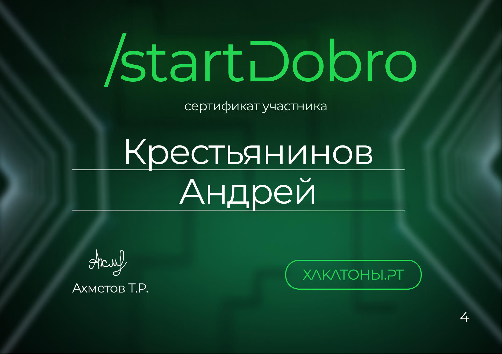

DIABETES BOT
============
MVP телеграм-бота, сделанный в рамках хакатона **StartDobro**.  
Главная цель проекта - обеспечение больных диабетом удобным инструментом для получения самой актуальной информации о заболевании.  

Функционал:  
- Регистрация пользователя.
- Возможность принимать и отправлять домашнее задание.
- Размещение информации о Фонде Борьбы с Диабетом и его площадках.
- В перспективе - формирование рекомендаций для обучения.

## Старт
1. Установка пакетов - `pip install -r requirements.txt`
2. В папке проекта создаём файл **.env**, в котором указываем TOKEN тг-бота.
3. Запуск приложения - `python handlers.py`

## Завершение
Благодарим читателя за интерес к проекту, будем рады вашей обратной связи!
